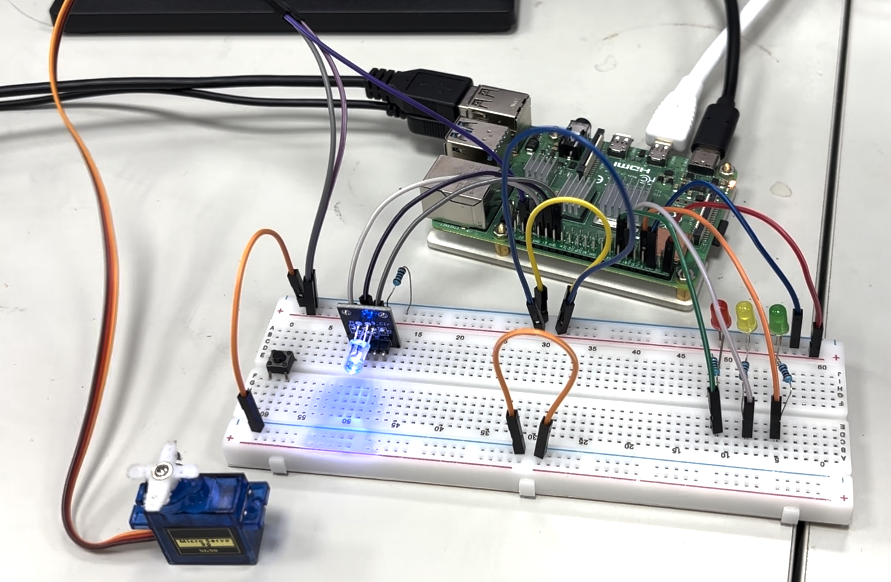
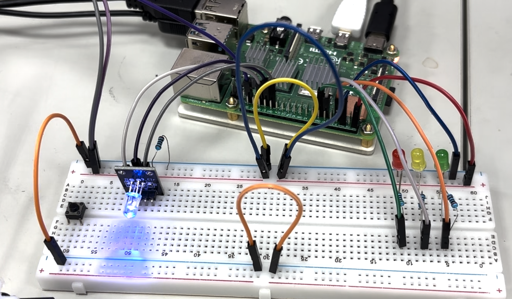
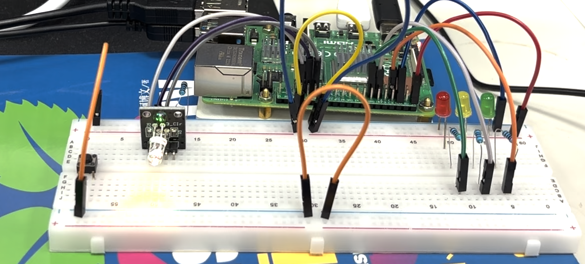
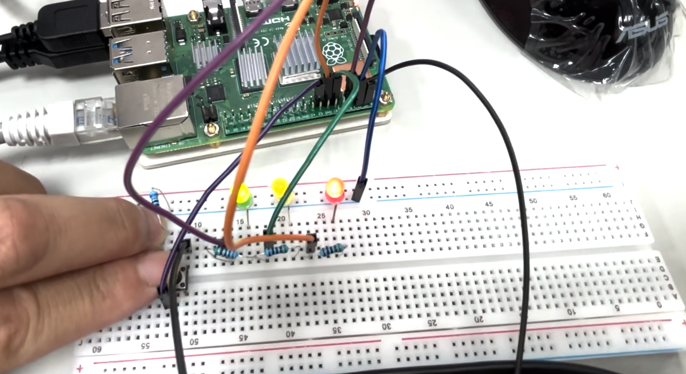

# 樹莓派筆記

## 用程式控制 servo motor

> 成果展示(以下為 YT 連結)

---

## 

---

> 程式碼

## (進階)用頁面的視窗-即時控制你的 LED 燈色

- 用 Tkinter 函式庫創建控制 RGB 參數的(GUI)圖形介面橫桿，並即時將參數傳遞給 GPIO 庫來控制 RGB LED 的燈色

> 成果展示(以下為 YT 連結)

---

## 

---

> 程式碼-請見 `02_dynamicLed.py`

## 用程式控制 RGB 燈的閃爍

> 成果展示(以下為 YT 連結)

---

## 

---

## 用程式控制你的 LED 燈的明滅

> 成品(直接點擊以下圖片連接到 yt)

---

## 

---

> 程式

## 認識基本項目

> 認識 GPIO

- GPIO（General Purpose Input/Output）｜引腳
  - 我使用的是有 40 個引腳（或 26 個，取決於您的 Pi 型號）
  - 引腳是所謂的『GPIO 介面』的一部分
    - 在這些介面中，有四種主要的引腳:
      • 電源: 提供 3.3V 和 5V 的直流電源
      • 接地（GND）: 連接到地端，以閉合電路
      • DNC: 代表“不連接”，所以可以忽略
      • GPIO: 可以設置為發送(output)或接收(input)控制電壓

- GPIO 代表“通用輸入/輸出”，正是這些引腳讓 Raspberry Pi 發揮了其功效。因為這些引腳沒有特定的功能，所以可以設置為某個專用功能，例如『控制信號』

> 麵包板 的通電範例

- 為了讓接線漂亮一點，特地上網看了麵包版的接法：

- 紅電軌 ＝> 正極
- 黑/藍電軌 ＝> 負極
- 

- 中間橫向排序的 5 孔是通電的，有以 ABCDE 為一組，FGHIJ 為一組
- 
- 五孔為一組，線路一樣燈泡都亮：
- 
- 也可以這樣插電：
- 

- 
